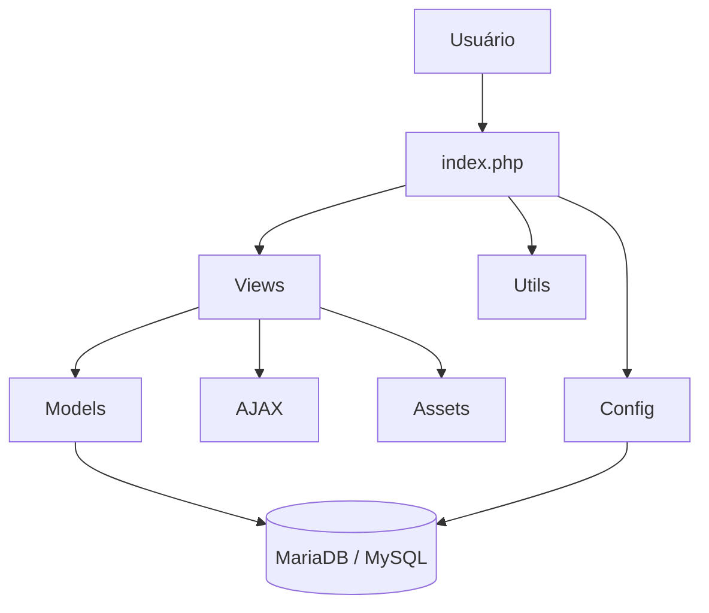

← [Voltar para a documentação](../README.md)

# 07 — Arquitetura MVC Simplificada

Arquitetura inspirada em MVC, sem camada Controller formalmente separada.

---

← [Voltar para a documentação](../README.md)
