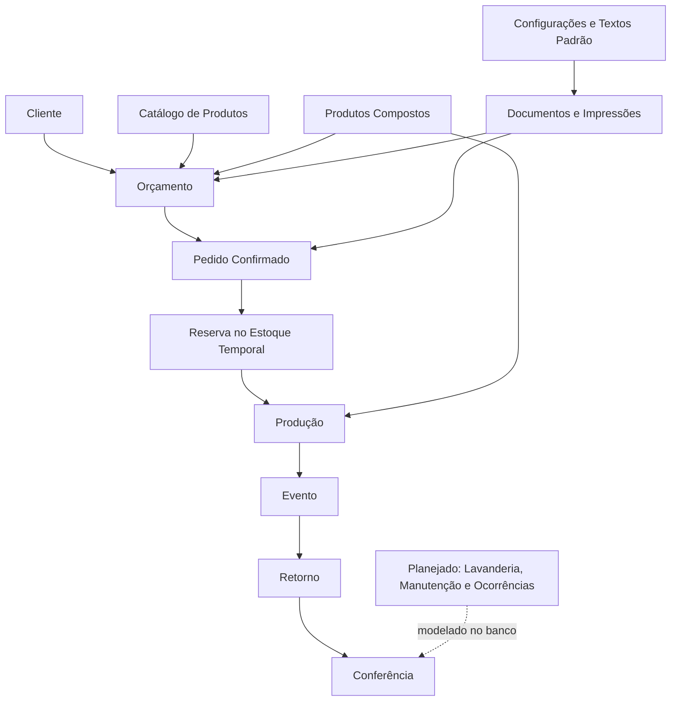

← [Voltar para a documentação](../README.md)

# 00 — Blueprint Geral

Este diagrama apresenta a visão geral do sistema sem tratá-lo como ERP completo. O foco é o ciclo operacional de locação para eventos.

---

← [Voltar para a documentação](../README.md)
