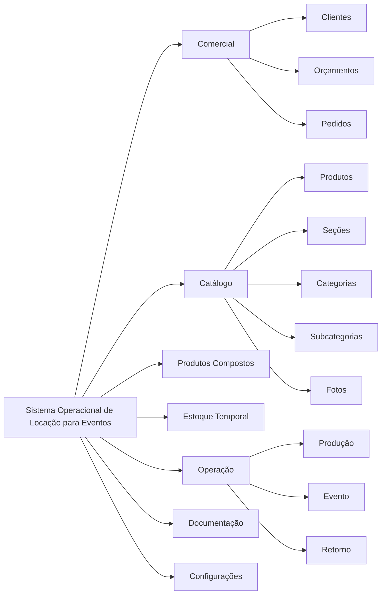

← [Voltar para a documentação](../README.md)

# 01 — Visão Geral do Sistema

```mermaid
flowchart LR
    S[Sistema Operacional de Locação para Eventos]

    S --> C[Comercial]
    S --> CAT[Catálogo]
    S --> PC[Produtos Compostos]
    S --> EST[Estoque Temporal]
    S --> OPE[Operação]
    S --> DOC[Documentação]
    S --> CONF[Configurações]

    C --> C1[Clientes]
    C --> C2[Orçamentos]
    C --> C3[Pedidos]

    CAT --> CAT1[Produtos]
    CAT --> CAT2[Seções]
    CAT --> CAT3[Categorias]
    CAT --> CAT4[Subcategorias]
    CAT --> CAT5[Fotos]

    OPE --> O1[Produção]
    OPE --> O2[Evento]
    OPE --> O3[Retorno]
```

Diagrama de domínios principais do sistema.

---

← [Voltar para a documentação](../README.md)
