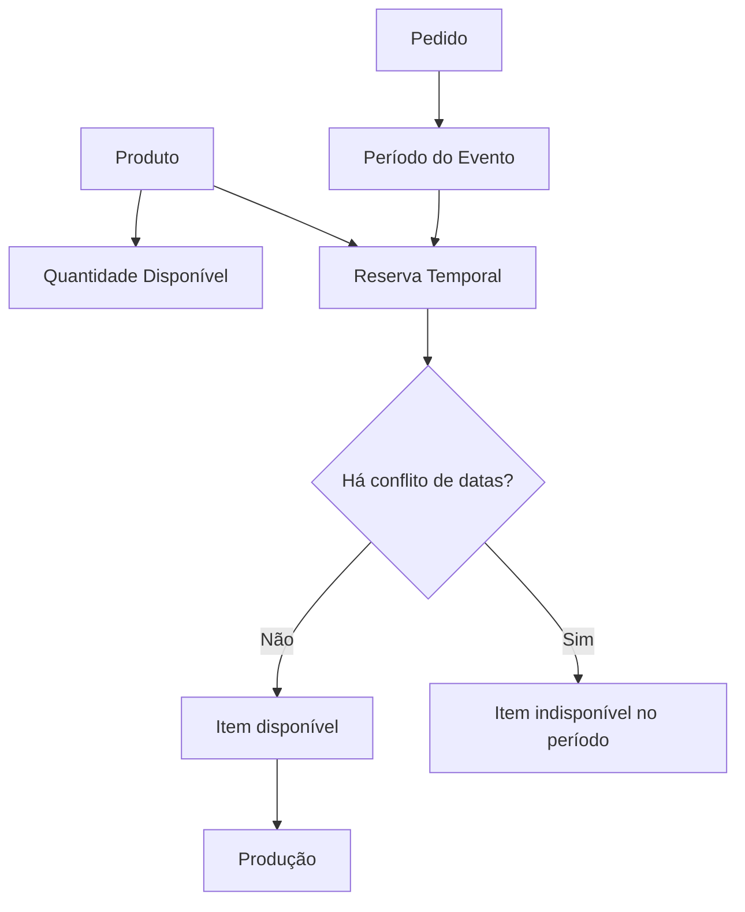

← [Voltar para a documentação](../README.md)

# 05 — Estoque Temporal

Representação do conceito de estoque temporal: o item não sai definitivamente do estoque, apenas fica indisponível durante um período.

---

← [Voltar para a documentação](../README.md)
