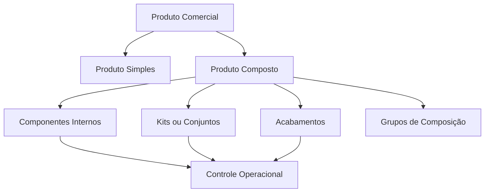

← [Voltar para a documentação](../README.md)

# 06 — Produtos Compostos

Diagrama para explicar a diferença entre a visão comercial do produto e sua estrutura operacional interna.

---

← [Voltar para a documentação](../README.md)
