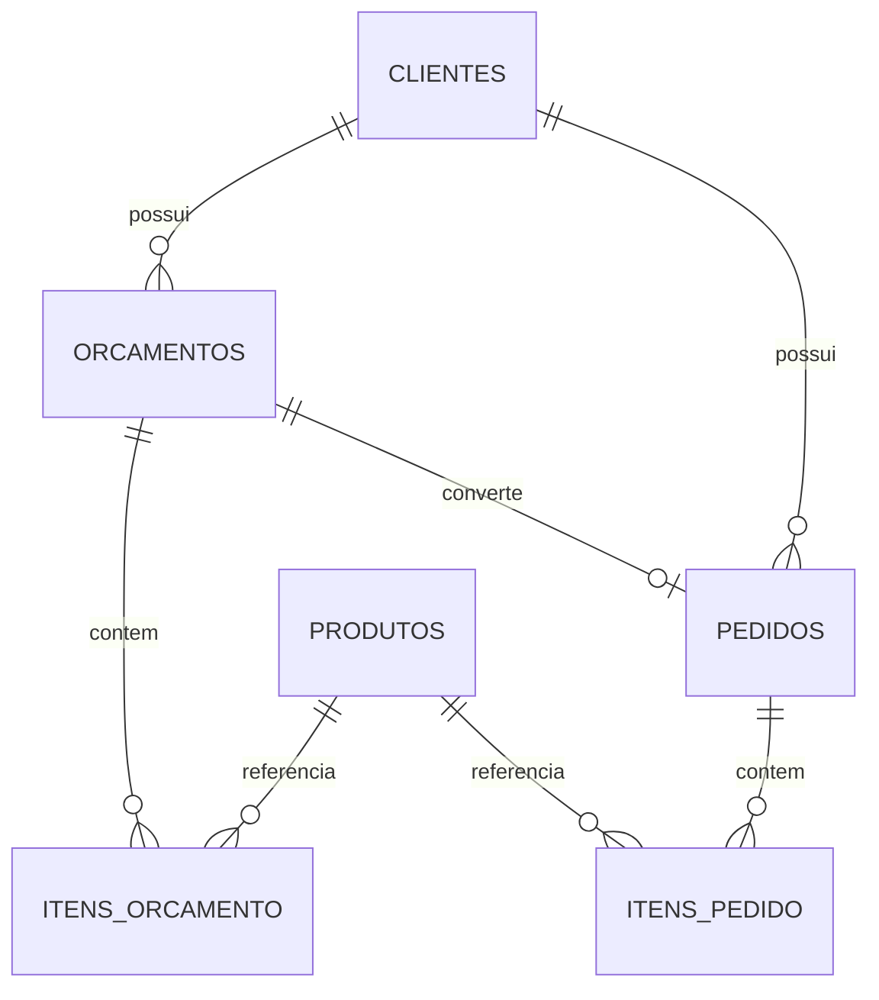

← [Voltar para a documentação](../README.md)

# 08 — ERD Comercial



## Objetivo

Este diagrama representa o domínio comercial do sistema, responsável pelo relacionamento entre clientes, orçamentos e pedidos.

Fluxo principal:

```text
Cliente
   ↓
Orçamento
   ↓
Pedido
```

## Observação

Durante as fases iniciais de modelagem foram estudadas estruturas para consultas e pré-reservas de disponibilidade.

Com a evolução do sistema, o fluxo comercial principal foi consolidado diretamente entre clientes, orçamentos e pedidos.

Consultas de disponibilidade permanecem como funcionalidade de apoio ao processo comercial e poderão evoluir futuramente para mecanismos de previsão de demanda ou pré-reserva operacional.

---

← [Voltar para a documentação](../README.md)
