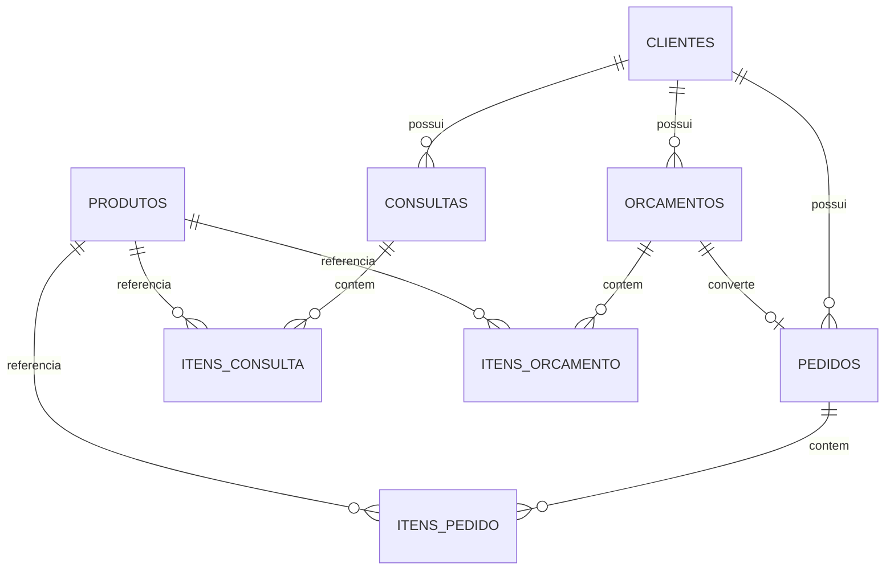

← [Voltar para a documentação](../README.md)

# 08 — ERD Comercial

```mermaid
erDiagram
    CLIENTES ||--o{ CONSULTAS : possui
    CLIENTES ||--o{ ORCAMENTOS : possui
    CLIENTES ||--o{ PEDIDOS : possui
    CONSULTAS ||--o{ ITENS_CONSULTA : contem
    ORCAMENTOS ||--o{ ITENS_ORCAMENTO : contem
    ORCAMENTOS ||--o| PEDIDOS : converte
    PEDIDOS ||--o{ ITENS_PEDIDO : contem
    PRODUTOS ||--o{ ITENS_CONSULTA : referencia
    PRODUTOS ||--o{ ITENS_ORCAMENTO : referencia
    PRODUTOS ||--o{ ITENS_PEDIDO : referencia
```

ERD modular do domínio comercial.

---

← [Voltar para a documentação](../README.md)
