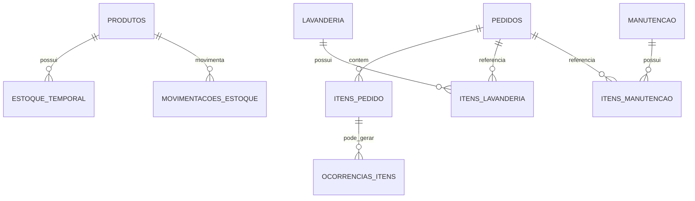

← [Voltar para a documentação](../README.md)

# 10 — ERD Operação

ERD modular de operação. Lavanderia e manutenção estão representadas como estrutura modelada no banco, não como módulos operacionais concluídos.

---

← [Voltar para a documentação](../README.md)
