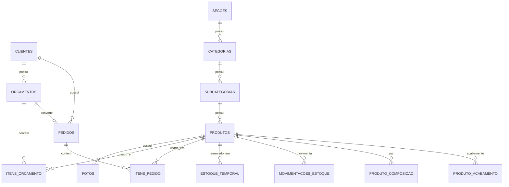

← [Voltar para a documentação](../README.md)

# 11 — ERD Completo Resumido

Visão resumida do ERD completo para GitHub. O ERD detalhado pode ser dividido por domínio para melhorar a leitura.

---

← [Voltar para a documentação](../README.md)
