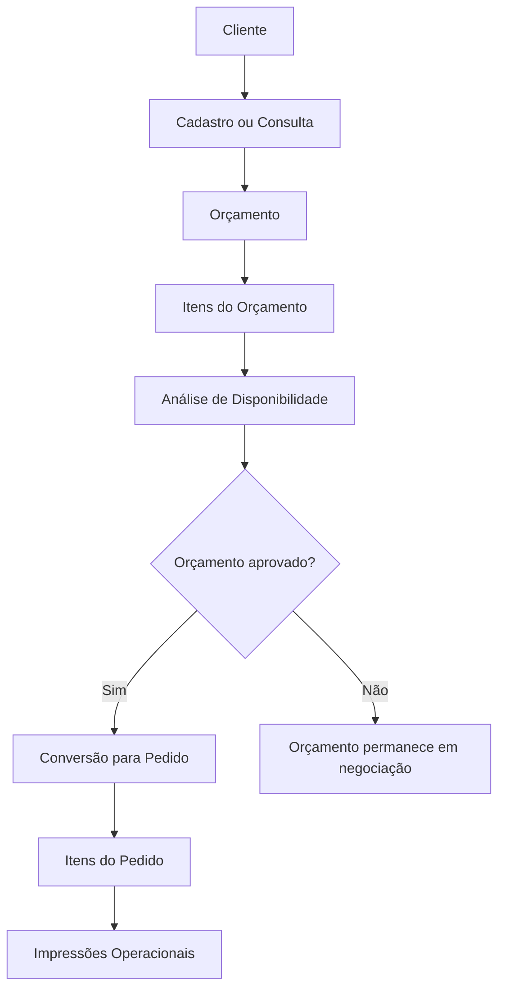

← [Voltar para a documentação](../README.md)

# 02 — Fluxo Comercial

```mermaid
flowchart TD
    A[Cliente] --> B[Cadastro ou Consulta]
    B --> C[Orçamento]
    C --> D[Itens do Orçamento]
    D --> E[Análise de Disponibilidade]
    E --> F{Orçamento aprovado?}
    F -- Sim --> G[Conversão para Pedido]
    F -- Não --> H[Orçamento permanece em negociação]
    G --> I[Itens do Pedido]
    I --> J[Impressões Operacionais]
```

Fluxo comercial desde o atendimento até a confirmação do pedido.

---

← [Voltar para a documentação](../README.md)
