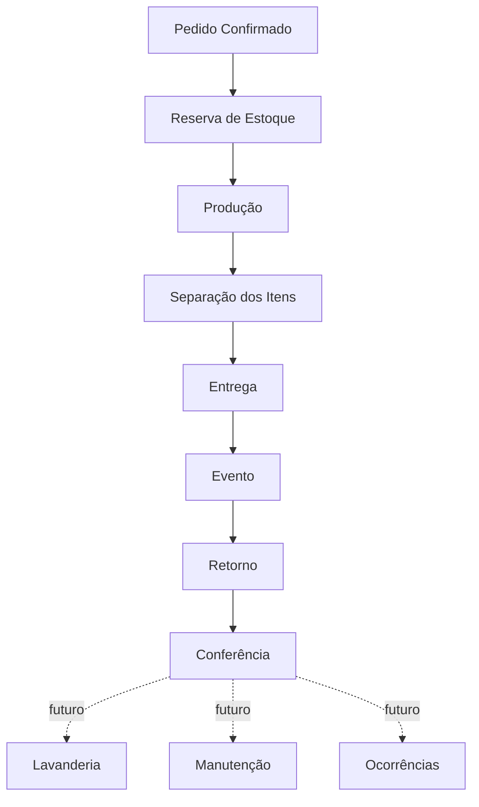

← [Voltar para a documentação](../README.md)

# 03 — Fluxo Operacional

Fluxo operacional principal após a confirmação do pedido. Lavanderia, manutenção e ocorrências aparecem como processos planejados/modelados, não como módulos concluídos.

---

← [Voltar para a documentação](../README.md)
