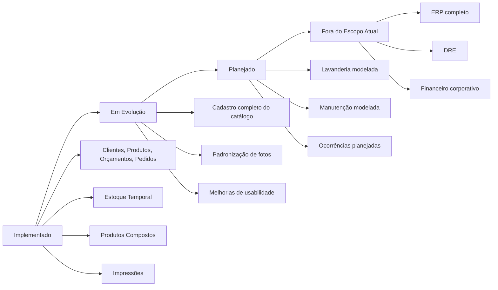

← [Voltar para a documentação](../README.md)

# 12 — Roadmap Visual

Roadmap visual separando implementado, em evolução, planejado e fora do escopo.

---

← [Voltar para a documentação](../README.md)
